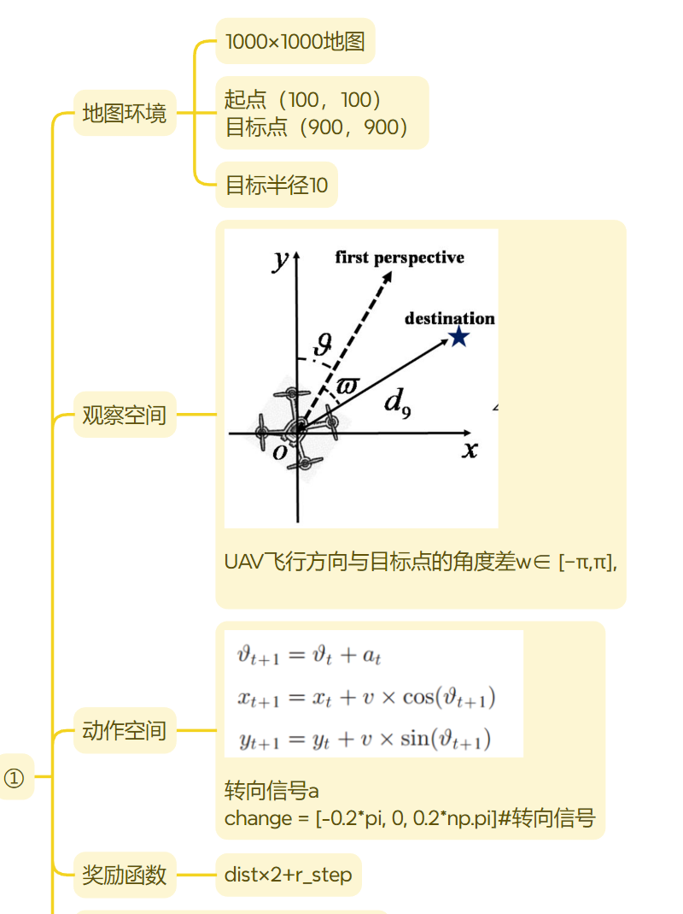
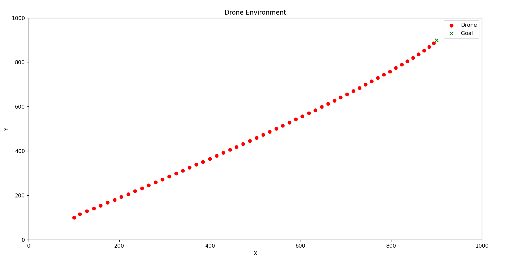
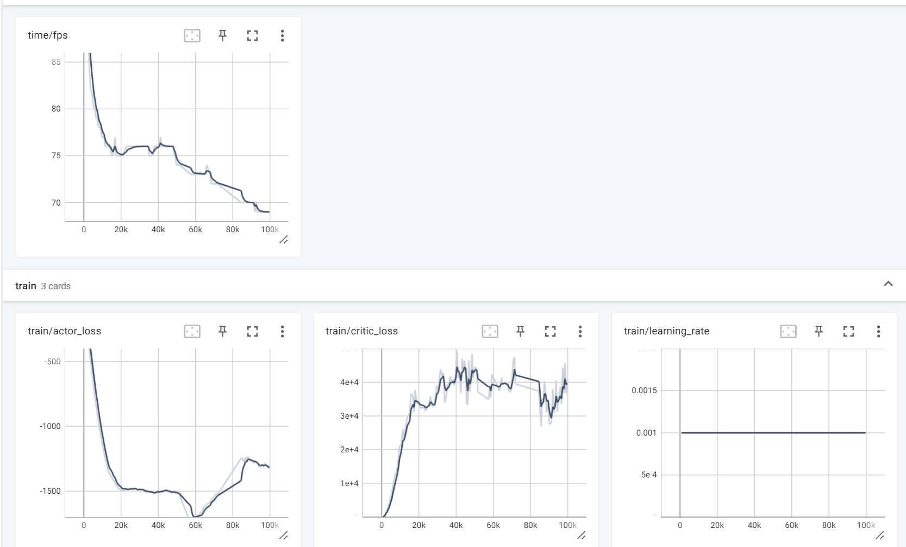
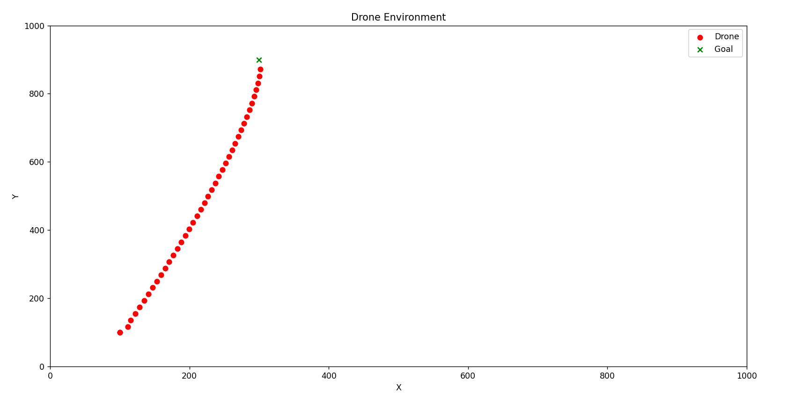
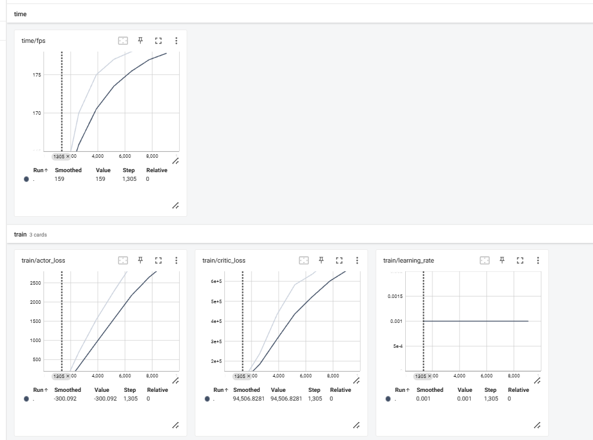
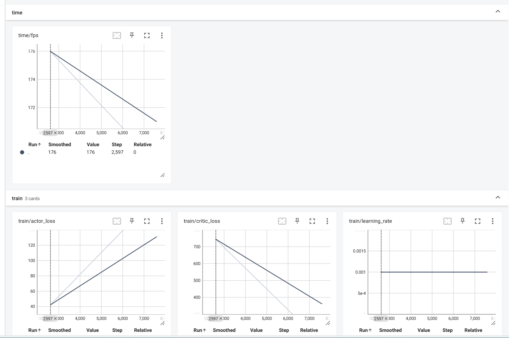
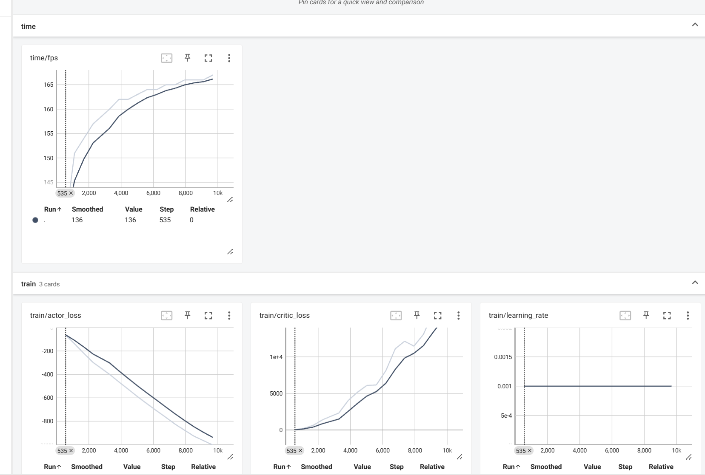
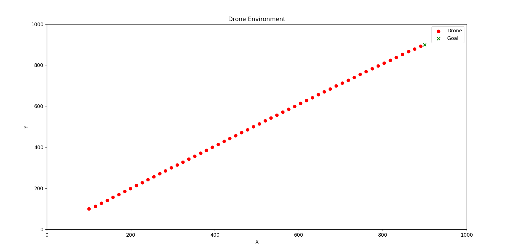
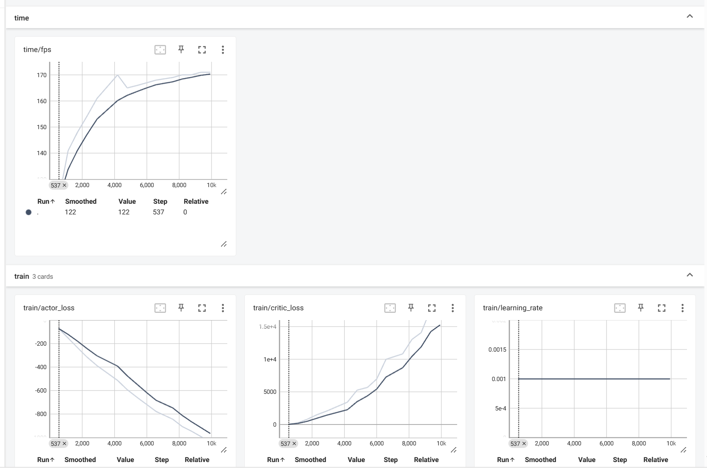

# my_UAV无障碍版本(done)DDPG
## 环境配置

## 运行结果

## 泛化分析，目标点设置300，900.

## 动作空间change = [-0.5*np.pi,0.5*np.pi]#转向信号

## 3.测试观测空间扩大1000倍是否影响，即（判断 是否需要归一化，实验结果证明确实需要归一化，重要的信息要保留，不可以被“遮挡”）
### 3.1 观测空间扩大1000倍[angel*1000]

### 3.2 观测空间改为[angel,900]

### 3.3 参考标准的观测空间[angel]

### 3.4 观测空间改为[pi,0]

