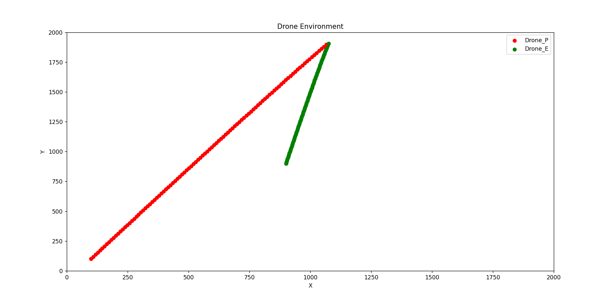
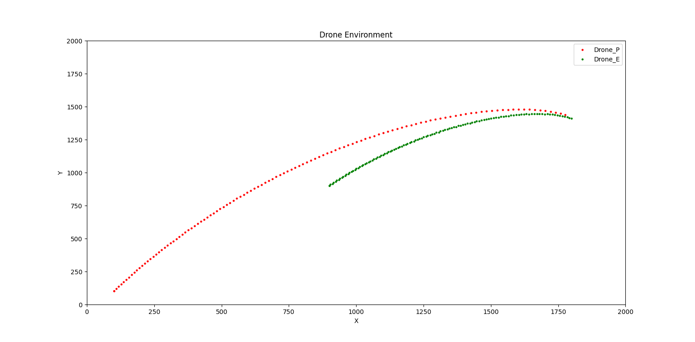
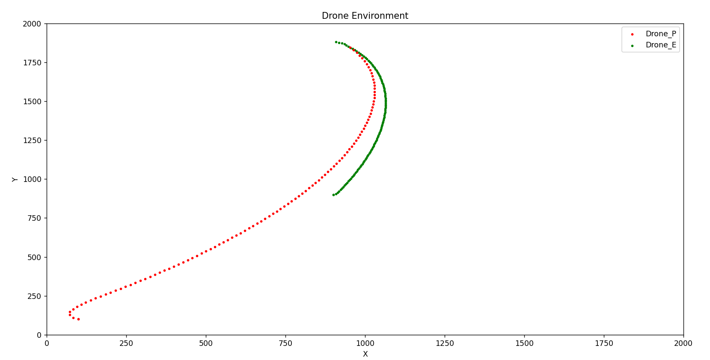
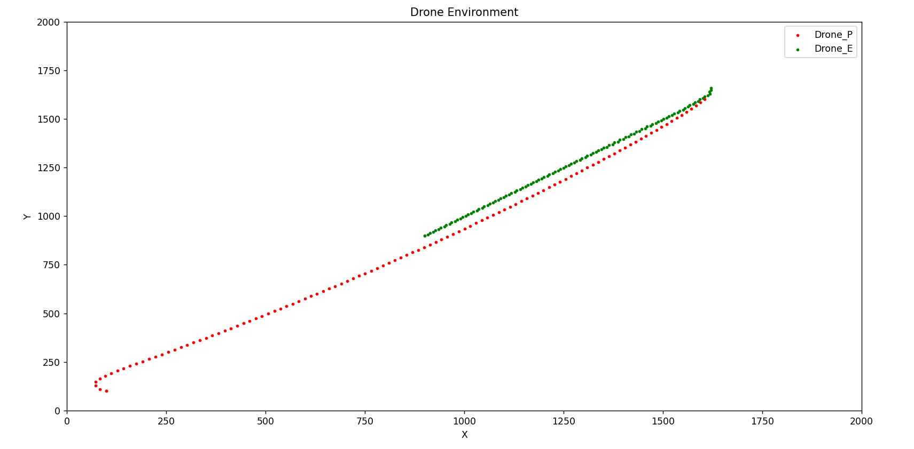
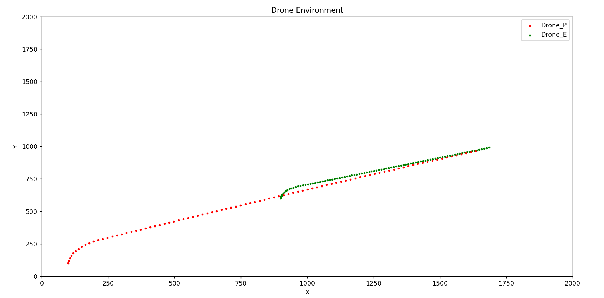

#  V1.3（使用DDPG连续动作空间，无障碍，目标点是动态移动的,并且训练逃逸者E）
## 动作空间change = [-0.5*np.pi,0.5*np.pi]#转向信号，观察空间两份，追击者P在step函数里根据预训练好的模型和自己的观察空间决策自己的action
## 训练逃逸者的文件结构env_v3_e,train_e,env_v3_e里面实现对追逃者的动作选择和执行
结果分析：
1.使用和原追击者完全相反的奖励函数

2.使用和原追击者完全相反的策略（速度P20，E10，r=-1*((d_lod - d_new) * 2 )+ 36）

分析：奖励函数常为正，引导逃逸者趋向存活更长时间。且和二者距离相关，引导反方向逃逸。图一原因：直接去边界可以获得相对其他的更大的奖励和。
文件结构：
env_v3_e.py---env环境
train_e.py---训练E文件
test.py---测试E文件
其他文件---原来1.2的文件
有问题，改变观察空间

改进调整噪声的范围（0.1-->0.05-->0.02)

使用归一化
