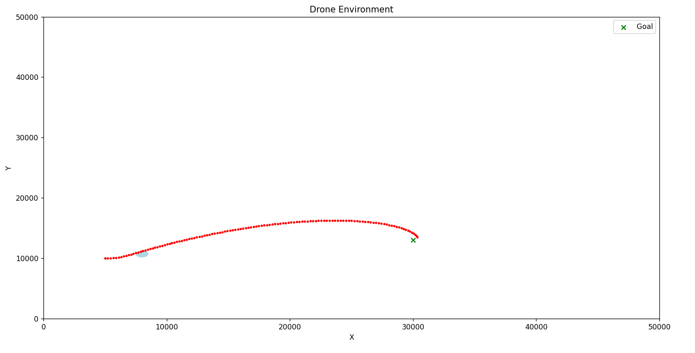
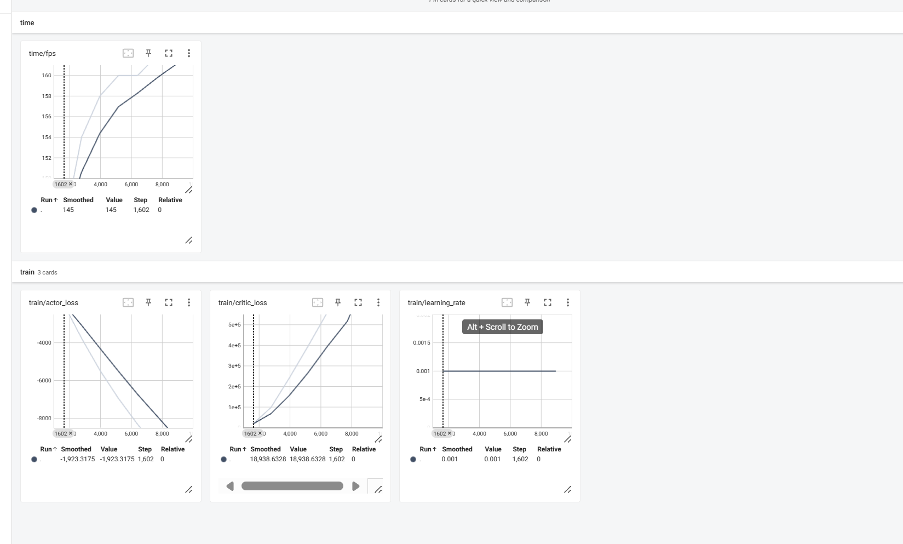
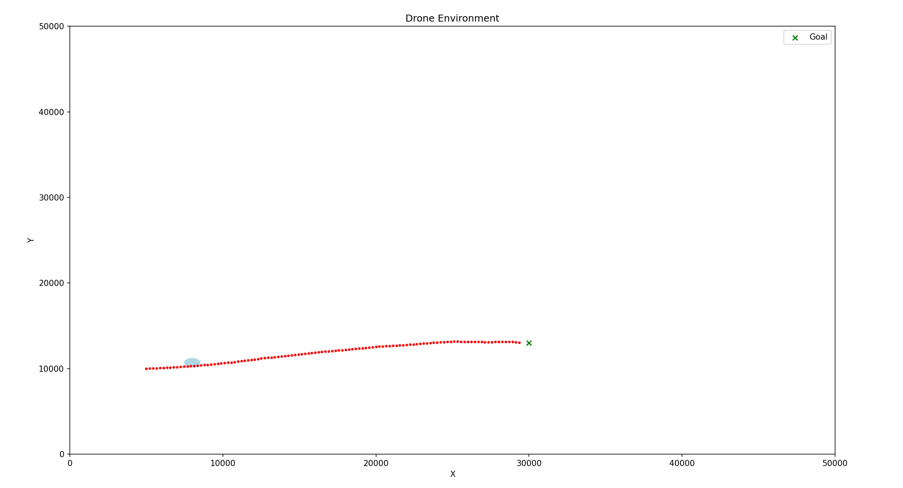
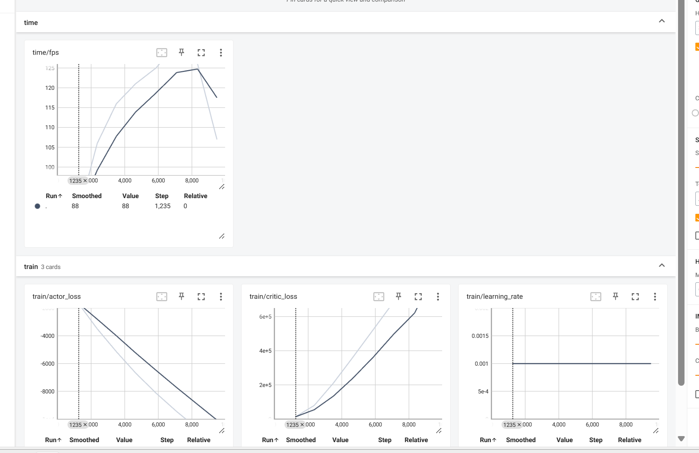
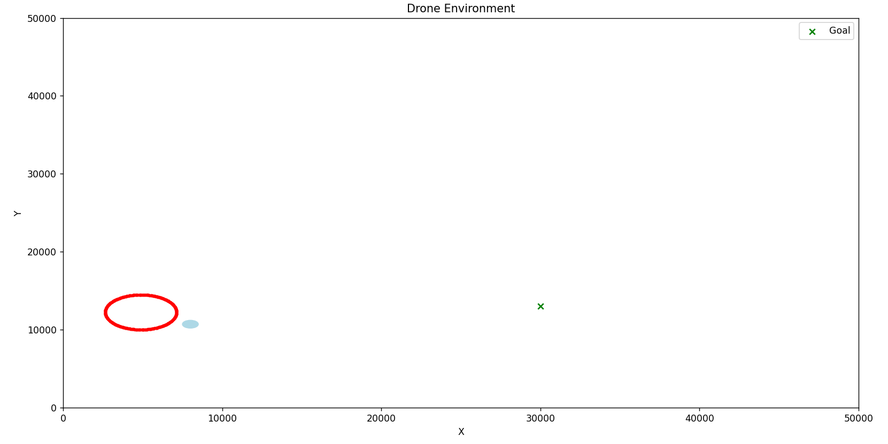
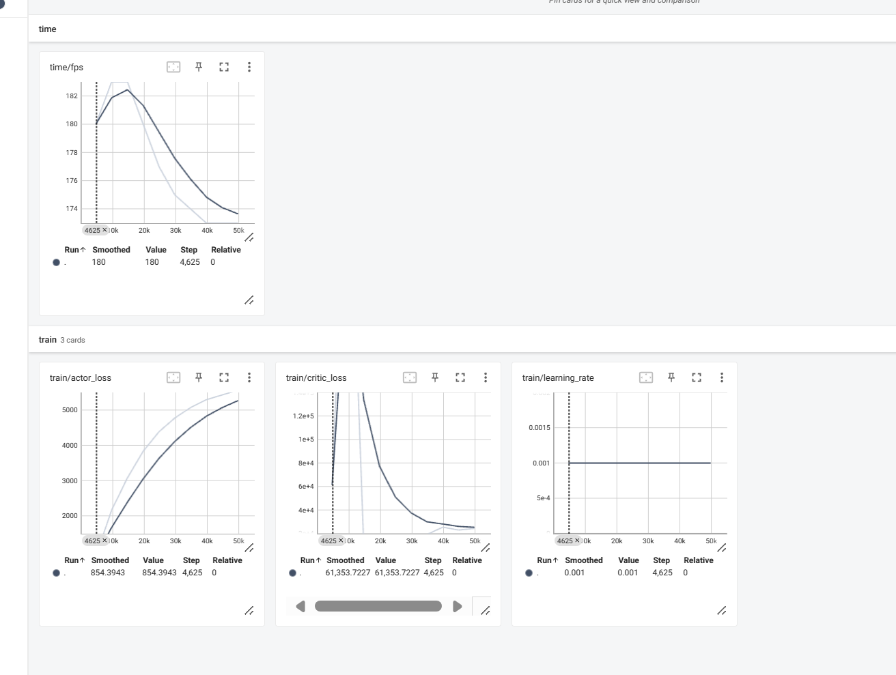
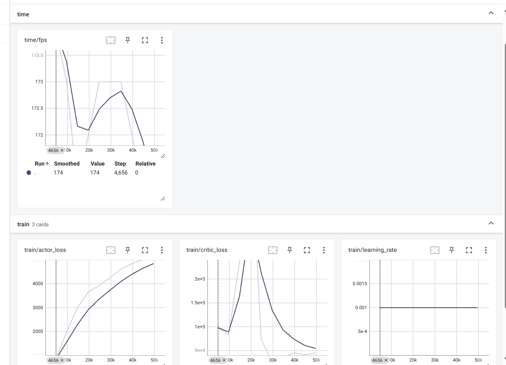
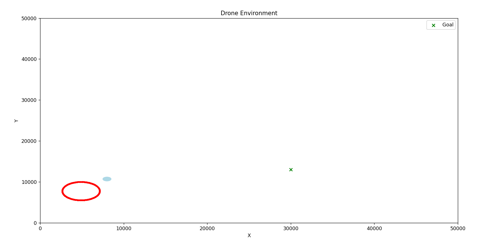
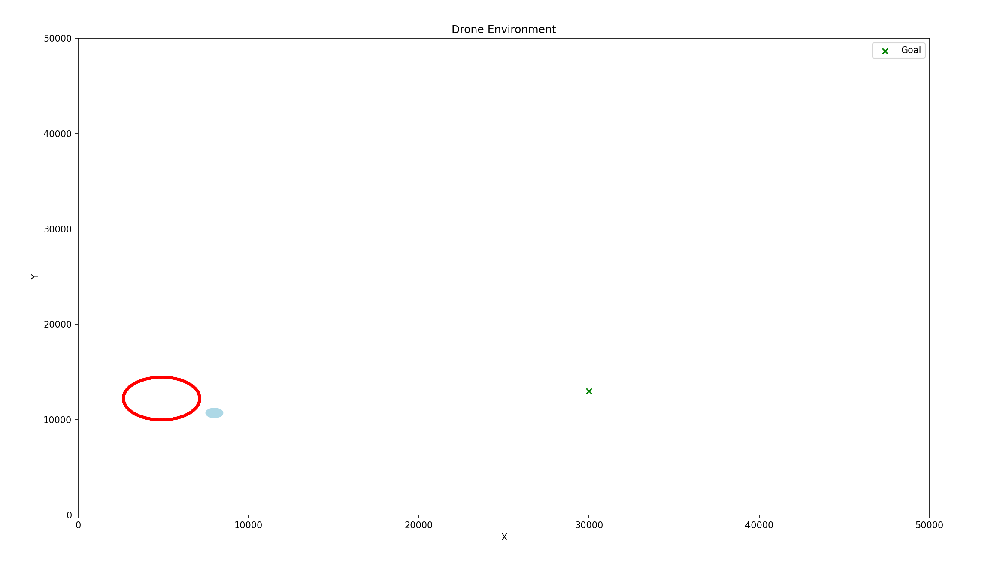

# my_UAV障碍版本
## 1.环境设置

## 2. 实验记录（调整观察空间的尺寸和动作空间的尺寸）
### 2.1 观测空间[-pi~pi]再除2pi归一化[0.5~0.5]，动作空间【-1~1】。

### 2.1.1 观测空间[-pi~pi]再除pi归一化到[-1,1]，动作空间设置【-1~1】。

### 2.2 观测空间[-pi~pi]再除2pi归一化，动作空间【-1~1】，执行动作*0.1

### 2.3 观测空间[-pi~pi]再÷2pi÷10归一化，动作空间【-0.1~0.1】

### 2.4 观测空间[-pi~pi]再÷pi÷10归一化到【0.1~0.1】，动作空间【-0.1~0.1】

